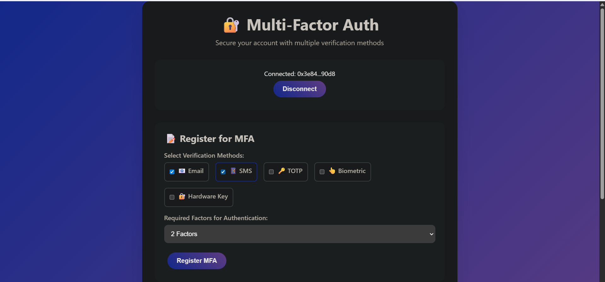

# Multi-Factor Authentication DApp Frontend

A decentralized application (DApp) frontend for interacting with the Multi-Factor Authentication smart contract on Aptos blockchain.

## Features

- 🔐 **Wallet Connection**: Connect with Petra Wallet or other Aptos wallets
- 📝 **MFA Registration**: Register with multiple verification methods
- ✅ **Factor Verification**: Verify different authentication factors
- 📊 **Profile Management**: View authentication status and verified factors
- 📱 **Responsive Design**: Works on desktop and mobile devices
- 🎨 **Modern UI**: Clean and intuitive user interface

## Prerequisites

1. **Aptos Wallet**: Install [Petra Wallet](https://petra.app/) extension
2. **Test APT**: Get test tokens from [Aptos Faucet](https://aptoslabs.com/testnet-faucet)
3. **Contract Deployment**: Deploy the MFA smart contract first
4. **Node.js**: For development server (optional)

## Quick Start

### Option 1: Direct Browser (Simple)
1. Open `index.html` directly in your browser
2. Connect your wallet
3. Start using the MFA functions

### Option 2: Development Server (Recommended)
1. Install dependencies:
   ```bash
   npm install
   ```

2. Start development server:
   ```bash
   npm run dev
   ```

3. Open browser at `http://localhost:8080`

### Option 3: Python Server
```bash
python -m http.server 8000
# or
python3 -m http.server 8000
```

## Configuration

Update the contract address in `index.html`:

```javascript
const CONTRACT_ADDRESS = "0xYOUR_DEPLOYED_CONTRACT_ADDRESS";
```

Replace with your actual deployed contract address.

## Usage Guide

### 1. Connect Wallet
- Click "Connect Wallet" button
- Approve connection in your wallet
- Ensure you're on Aptos Testnet

### 2. Register for MFA
- Select verification methods (email, SMS, TOTP, biometric, hardware key)
- Choose required factors for authentication (1-5)
- Click "Register MFA"
- Confirm transaction in wallet

### 3. Verify Factors
- Select a factor type from dropdown
- Click "Verify Factor"
- Confirm transaction in wallet

### 4. View Profile
- Your MFA profile will display automatically
- Shows authentication status and verified factors
- Click "Refresh Profile" to update

## Supported Verification Methods

- 📧 **Email**: Email-based verification
- 📱 **SMS**: SMS text message verification
- 🔑 **TOTP**: Time-based One-Time Password (like Google Authenticator)
- 👆 **Biometric**: Fingerprint/Face ID verification
- 🔐 **Hardware Key**: Physical security keys (YubiKey, etc.)

## Error Handling

The frontend handles various error scenarios:

- **E_ALREADY_REGISTERED**: User already has MFA profile
- **E_NOT_REGISTERED**: User needs to register first
- **E_INVALID_VERIFICATION**: Invalid verification method selected
- **Wallet Errors**: Connection and transaction failures

## File Structure

```
frontend/
├── index.html          # Main application file
├── package.json        # Dependencies and scripts
└── README.md          # This documentation
```

## Development

### Adding New Features
1. Modify `index.html` for UI changes
2. Update JavaScript functions for new contract interactions
3. Test with your deployed contract

### Styling
The CSS is embedded in `index.html`. Key classes:
- `.container`: Main wrapper
- `.form-section`: Form containers
- `.btn`: Button styling
- `.status`: Status message styling

### JavaScript Functions
- `connectWallet()`: Handle wallet connection
- `registerMFA()`: Register user for MFA
- `verifyFactor()`: Verify authentication factor
- `loadUserProfile()`: Load user's MFA profile

## Deployment

### Vercel
```bash
npx vercel --prod
```

### Netlify
1. Drag and drop `frontend` folder to Netlify
2. Or connect GitHub repository

### GitHub Pages
1. Push to GitHub repository
2. Enable Pages in repository settings

## Troubleshooting

### Wallet Connection Issues
- Ensure Petra Wallet is installed and unlocked
- Check you're on Aptos Testnet
- Refresh page and try again

### Transaction Failures
- Ensure you have sufficient APT for gas fees
- Check contract address is correct
- Verify contract is deployed on current network

### Profile Not Loading
- Check browser console for errors
- Ensure contract has the correct resource structure
- Verify wallet is connected to correct account

## Security Notes

⚠️ **Important Security Considerations:**

1. **Testnet Only**: This is for testing purposes only
2. **Private Keys**: Never share your private keys or seed phrases
3. **Contract Auditing**: Audit smart contracts before mainnet deployment
4. **HTTPS**: Use HTTPS in production
5. **Input Validation**: Validate all user inputs

## Contributing

1. Fork the repository
2. Create feature branch
3. Make changes
4. Test thoroughly
5. Submit pull request

## Support

For issues and questions:
- Check browser console for errors
- Verify wallet connection
- Ensure contract is properly deployed
- Test on Aptos Testnet first

## License

MIT License - see LICENSE file for details
