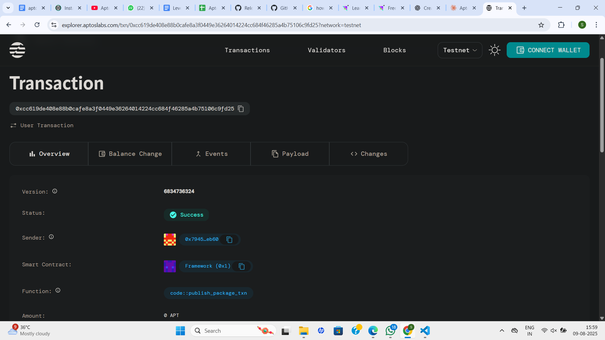

# Multi-Factor Authentication

## Project Description

This project implements an on-chain Multi-Factor Authentication (MFA) system using Move smart contracts on the Aptos blockchain. The system enables users to secure their digital identities by requiring multiple verification methods before granting access to protected resources. Users can configure various authentication factors such as biometric verification, SMS codes, email verification, hardware tokens, and other security methods to create a robust, decentralized authentication framework.

## Project Vision

Our vision is to revolutionize digital security by bringing Multi-Factor Authentication directly onto the blockchain, creating a trustless, transparent, and immutable authentication system. By leveraging the inherent security and decentralization of blockchain technology, we aim to eliminate single points of failure in traditional authentication systems while providing users with complete control over their security configurations. This on-chain MFA system will serve as a foundation for secure decentralized applications, protecting user assets and sensitive operations in the Web3 ecosystem.

## Key Features

- **Decentralized Authentication**: Complete on-chain MFA system eliminating reliance on centralized authentication providers
- **Multiple Verification Methods**: Support for various authentication factors including biometric, SMS, email, hardware tokens, and custom verification methods
- **Flexible Factor Requirements**: Users can configure the minimum number of verification factors required for successful authentication
- **Session Management**: Tracks verified factors during authentication sessions to prevent replay attacks
- **Immutable Audit Trail**: All authentication events are recorded on-chain for complete transparency and auditability
- **User-Controlled Security**: Users have full control over their authentication methods and security requirements
- **Gas-Optimized Operations**: Efficient smart contract design minimizing transaction costs for authentication operations
- **Extensible Architecture**: Modular design allowing easy integration of new verification methods

## Future Scope

### Enhanced Security Features
- **Time-Based Authentication**: Implementation of time-locked authentication sessions with automatic expiry
- **Risk-Based Authentication**: Dynamic factor requirements based on transaction value, location, and behavior patterns
- **Emergency Recovery**: Secure account recovery mechanisms for users who lose access to their verification methods
- **Multi-Signature Integration**: Combining MFA with multi-signature wallets for enterprise-grade security

### Advanced Verification Methods
- **Biometric Integration**: Support for fingerprint, facial recognition, and voice authentication through zero-knowledge proofs
- **Hardware Security Modules**: Integration with dedicated hardware tokens and secure enclaves
- **Social Recovery**: Community-based verification methods using trusted contacts
- **Behavioral Authentication**: Machine learning-based user behavior analysis for continuous authentication

### Ecosystem Integration
- **DeFi Protocol Integration**: Native MFA support for major DeFi platforms and protocols
- **Cross-Chain Compatibility**: Extension to multiple blockchain networks for universal authentication
- **Developer SDK**: Comprehensive development tools for easy MFA integration into dApps
- **Mobile Authentication Apps**: Dedicated mobile applications for seamless user experience

### Enterprise Solutions
- **Organization Management**: Multi-tenant support for businesses and organizations
- **Compliance Framework**: Built-in compliance tools for regulatory requirements (KYC/AML)
- **Analytics Dashboard**: Comprehensive security analytics and threat detection
- **API Gateway**: RESTful APIs for easy integration with existing enterprise systems

## Contract Details
0xcc619de408e88b0cafe8a3f0449e36264014224cc684f46285a4b75106c9fd25
